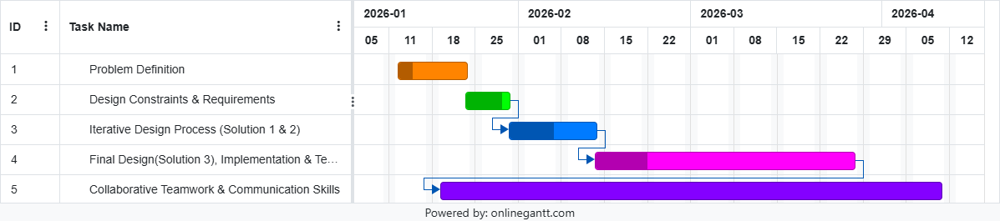

# MineSweeper CLI - Report

## 1. Introduction

This project focuses on the development of a command-line Minesweeper application designed to apply structured software engineering and testing principles. The system is implemented using test-driven development and follows the Model–View–Controller architecture to ensure testability. Minesweeper was selected due to its clear rules and state-based logic, making it suitable for verification. The following sections will describe the design constraints, development process, implementation approach, and testing strategy used in this project.

## 2. Design Problem

### 2.1 Problem Definition

The objective of this project is to design and implement a command-line version of **MineSweeper**. It aims to successfully test and validate all core mechanics of the game. The project will correctly handle grid generation, random mine placements, user inputs and state transitions in a deterministic manner. It will prioritize the use of the MVC architecture, separating code cleanly making debugging and editing simpler and straightforward. The end product will focus more on reliability and sustainability more than graphical complexity.

### 2.2 Design Requirements

#### 2.2.1 Functions

- Displaying an m x n minefield grid.
- Select a spot on the grid.
- Display numbers based on how many mines surround a particular spot.
- Detect and switch to Win / Playing / Loss states.

#### 2.2.2 Objectives

- Maintain clear adherence to the Model View Controller (MVC) architecture
- Support TDD - Test Driven Development and well-defined test cases.
- Provide a simple and easy to navigate interface for the game.

#### 2.2.3 Constraints

| Constraint                                       | Satisfiable? |
| ------------------------------------------------ | ------------ |
| Needs to operate exclusively on the command line | Yes          |
| Should use Model-View-Controller architecture    | Yes          |
| Include automated **unit** testing using JUnit   | Yes          |
| Produce deterministic game behavior and results  | Yes          |
| Fully executable on a standard Java environment  | Yes          |

## 3. Solution

Throughout the design process, our team brainstormed multiple architectural approaches for the MineSweeper CLI application. Each iteration was evaluated primarily on **testability**, along with adherence to our design constraints (MVC architecture, deterministic behavior, JUnit compatibility, and CLI-only operation). The following subsections document our design evolution and the reasoning behind each iteration.

### 3.1 Solution 1: Monolithic Single-Class Design

Our initial approach placed all game logic, rendering, and input handling into a single `MineSweeper.java` class. The grid was represented as a 2D integer array, mines were placed using `Math.random()` directly in the constructor, and `System.out.println()` calls were embedded throughout the game logic methods. User input was read via a `Scanner` attached to `System.in` inside the main game loop.

**Architecture Overview:**

```
┌─────────────────────────────┐
│       MineSweeper.java      │
│  ┌───────────────────────┐  │
│  │ Grid + Mine Placement │  │
│  │ Game State Logic      │  │
│  │ Display / Rendering   │  │
│  │ Input Handling        │  │
│  │ Win/Loss Detection    │  │
│  └───────────────────────┘  │
└─────────────────────────────┘
```

**Why this solution was not selected (testing limitations):**

While this approach was quick to prototype, it presented significant obstacles from a testing perspective:

1. **Non-deterministic mine placement:** Using `Math.random()` directly meant that each run produced a different board layout. This made it impossible to write repeatable JUnit assertions, since expected outputs could not be predetermined.
2. **Tightly coupled I/O:** Because `System.out` and `Scanner(System.in)` were embedded in the logic methods, unit tests could not isolate the game model from the view. Testing any game rule required simulating console I/O, which added unnecessary complexity and fragility.
3. **No separation of concerns:** With everything in one class, it was not possible to independently test individual components such as mine counting, cell revealing, or win/loss detection. A bug in rendering could mask a bug in game logic, and vice versa.
4. **Path and data flow testing difficulty:** Since methods handled multiple responsibilities (e.g., a `revealCell()` method that both updated state and printed output), constructing clean control flow graphs for path testing was impractical. Data flow analysis was similarly hindered because variables served dual purposes across logic and presentation.

| Evaluation Criteria      | Rating  | Notes                                        |
| ------------------------ | ------- | -------------------------------------------- |
| Unit test isolation      | Poor    | Cannot test model without triggering I/O     |
| Deterministic test cases | Poor    | Random mine placement prevents repeatability |
| Path testing feasibility | Poor    | Methods mix logic with side effects          |
| MVC compliance           | Not met | All code resides in a single class           |
| Integration test clarity | Poor    | No distinct units to integrate               |

This evaluation made it clear that a fundamental architectural restructuring was needed before any meaningful test suite could be designed.

---

### 3.2 Solution 2: Partial MVC with Separated Model

Building on the shortcomings of Solution 1, our second iteration introduced a basic separation between the game model and the rest of the application. We created two classes: `GameModel.java` (containing the grid, mine placement, and game state logic) and `GameApp.java` (handling rendering and user input together).

Mine placement was improved by accepting a `java.util.Random` object as a constructor parameter, allowing a seeded random number generator to be injected during testing. This resolved the determinism problem identified in Solution 1.

**Architecture Overview:**

```
┌──────────────────┐      ┌──────────────────────┐
│  GameModel.java  │◄─────│    GameApp.java       │
│                  │      │                       │
│ - grid[][]       │      │ - Scanner input       │
│ - mines[][]      │      │ - System.out display  │
│ - gameState      │      │ - Game loop           │
│ - revealCell()   │      │ - Input parsing       │
│ - countMines()   │      └──────────────────────┘
│ - checkWin()     │
│ - Random seed    │
└──────────────────┘
```

**Improvements over Solution 1:**

- **Deterministic testing enabled:** By injecting a seeded `Random` object, the same board layout could be reproduced across test runs. This allowed us to write JUnit assertions with known expected values.
- **Model is independently testable:** Methods like `revealCell()`, `countMines()`, and `checkWin()` could now be called in JUnit tests without any console interaction.
- **Path testing became feasible:** With game logic isolated in `GameModel`, we could draw control flow graphs for individual methods and identify independent paths for path coverage testing.

**Use Case, Sequence, and Class Diagrams for Solution 2**

<p align="center">
  
</p>
<p align="center"><em>Figure 1: Use Case Diagram</em></p>

<br>

<p align="center">
  
</p>
<p align="center"><em>Figure 2: Sequence Diagram</em></p>

<p align="center">
  
</p>
<p align="center"><em>Figure 3: Class Diagram</em></p>

**Why this solution was still not selected (remaining testing limitations):**

1. **View and Controller still coupled:** `GameApp.java` combined both rendering and input handling. This meant that validating display correctness (e.g., does the grid render properly after a reveal?) still required simulating `System.in`, and testing input parsing required capturing `System.out`. These two concerns could not be tested independently.
2. **Integration testing gaps:** With only two classes, integration testing was limited to the interface between `GameModel` and `GameApp`. A proper MVC separation would provide three distinct units (Model, View, Controller) with well-defined interfaces, enabling more comprehensive integration tests between each pair.
3. **Boundary value and equivalence class testing for input:** Input validation logic was buried inside `GameApp.java` alongside rendering code. Performing equivalence class testing and boundary value testing on user input (e.g., row/column values at grid edges, negative numbers, non-integer entries) required instantiating the entire application rather than testing the input-handling unit in isolation.
4. **State transition testing complexity:** While the model tracked game states (Playing, Won, Lost), the transitions were partially triggered by `GameApp.java` logic. This split responsibility made it harder to design clean state transition test cases, since the state machine was distributed across two classes.

| Evaluation Criteria          | Rating  | Notes                                       |
| ---------------------------- | ------- | ------------------------------------------- |
| Unit test isolation          | Good    | Model is testable; View+Controller are not  |
| Deterministic test cases     | Good    | Seeded Random resolves repeatability        |
| Path testing feasibility     | Good    | Clean control flow in model methods         |
| MVC compliance               | Partial | Only M is separated; V and C are merged     |
| Integration test clarity     | Fair    | Only one integration boundary (Model ↔ App) |
| Boundary/equivalence testing | Fair    | Input validation not independently testable |
| State transition testing     | Fair    | State machine split across two classes      |

**Comparison of Solution 1 and Solution 2:**

| Criteria                      | Solution 1 (Monolithic) | Solution 2 (Partial MVC) |
| ----------------------------- | :---------------------: | :----------------------: |
| Deterministic tests           |            ✗            |            ✓             |
| Isolated model testing        |            ✗            |            ✓             |
| Isolated view testing         |            ✗            |            ✗             |
| Isolated controller testing   |            ✗            |            ✗             |
| Path testing feasibility      |            ✗            |            ✓             |
| Data flow testing feasibility |            ✗            |            ✓             |
| Integration test boundaries   |            0            |            1             |
| MVC compliance                |            ✗            |         Partial          |

This analysis demonstrated that while Solution 2 was a substantial improvement, achieving full testability across all required testing techniques (path testing, data flow, integration testing, boundary value, equivalence class, decision table, state transition, and use case testing) required a complete MVC separation. This insight directly informed the design of our final solution (Section 3.3).

---

### 3.3 Solution 3: Full MVC with Dependency Injection (Final Design)

Our final design fully separates the application into three independent classes, each with a single responsibility and injectable dependencies for complete test isolation.

**Architecture Overview:**

```
┌──────────────────────┐
│       App.java       │  (Entry point — wires components)
└──────┬───────────────┘
       │ creates
       ▼
┌──────────────────────────────────────────────────────────┐
│                MinesweeperController                     │
│                                                          │
│  - Scanner input          (injected)                     │
│  - startGame()                                           │
│  - processInput(line)                                    │
│  - handleRevealCommand(row, col)                         │
│  - handleFlagCommand(row, col)                           │
│                                                          │
│         │ delegates to              │ updates             │
│         ▼                           ▼                     │
│  ┌─────────────────┐    ┌──────────────────────┐         │
│  │ MinesweeperModel│    │  MinesweeperView     │         │
│  │                 │    │                      │         │
│  │ - mines[][]     │    │  - PrintStream out   │         │
│  │ - revealed[][]  │    │    (injected)        │         │
│  │ - flagged[][]   │    │  - displayBoard()    │         │
│  │ - gameState     │    │  - displayMessage()  │         │
│  │ - Random seed   │    │  - ANSI colors       │         │
│  │   (injected)    │    │  - Unicode borders   │         │
│  │                 │    │                      │         │
│  │ - revealCell()  │    └──────────────────────┘         │
│  │ - toggleFlag()  │                                     │
│  │ - countMines()  │                                     │
│  │ - isInBounds()  │                                     │
│  │ - floodReveal() │                                     │
│  │ - checkWin()    │                                     │
│  └─────────────────┘                                     │
└──────────────────────────────────────────────────────────┘
```

**Key Design Decisions:**

1. **Dependency Injection for all I/O:** `Random` is injected into the Model (deterministic boards), `PrintStream` into the View (capturable output), and `Scanner` into the Controller (simulatable input). This enables fully isolated unit testing without mocks or test-only code.

2. **GameState enum:** Replaced boolean flags with a `GameState` enum (`PLAYING`, `WON`, `LOST`) to prevent invalid state transitions and enable clean state transition testing.

3. **Extracted helper methods:** `floodReveal()`, `checkWinCondition()`, `revealAllMines()`, `isInBounds()` are each focused single-purpose methods, simplifying path testing and control flow graph construction.

4. **View is logic-free:** The View only reads Model state and renders it — no game logic, no input parsing. This ensures the View cannot introduce bugs into game behavior.

**How this solution resolves all testing limitations from Solutions 1 and 2:**

| Evaluation Criteria          | Rating    | Notes                                            |
| ---------------------------- | --------- | ------------------------------------------------ |
| Unit test isolation          | Excellent | All three classes testable independently         |
| Deterministic test cases     | Excellent | Seeded `Random` injection                        |
| Path testing feasibility     | Excellent | Clean single-purpose methods with clear CFGs     |
| MVC compliance               | Full      | Three distinct classes, clean boundaries         |
| Integration test clarity     | Excellent | 3 integration boundaries (M↔V, M↔C, M↔V↔C)       |
| Boundary/equivalence testing | Excellent | Input validation is isolated in Controller       |
| State transition testing     | Excellent | GameState enum with defined transitions          |
| Data flow testing            | Excellent | Variables have focused lifecycles within methods |

**Comparison of All Three Solutions:**

| Criteria                      | Solution 1 (Monolithic) | Solution 2 (Partial MVC) | Solution 3 (Full MVC) |
| ----------------------------- | :---------------------: | :----------------------: | :-------------------: |
| Deterministic tests           |            ✗            |            ✓             |           ✓           |
| Isolated model testing        |            ✗            |            ✓             |           ✓           |
| Isolated view testing         |            ✗            |            ✗             |           ✓           |
| Isolated controller testing   |            ✗            |            ✗             |           ✓           |
| Path testing feasibility      |            ✗            |            ✓             |           ✓           |
| Data flow testing feasibility |            ✗            |            ✓             |           ✓           |
| Integration test boundaries   |            0            |            1             |           3           |
| MVC compliance                |            ✗            |         Partial          |         Full          |
| Boundary/equivalence testing  |            ✗            |         Partial          |           ✓           |
| State transition testing      |            ✗            |         Partial          |           ✓           |

Solution 3 was selected as the final design because it is the only solution that enables all eight required testing techniques to be applied systematically.

---

## Design Constraints

The following four design constraints were identified and addressed in the final solution:

### Constraint 1: Economic Factors

- **Decision:** The entire project uses free, open-source tools — Java SE (standard JDK), JUnit 4, and a plain text editor. No paid libraries, cloud services, or proprietary frameworks are required.
- **Impact:** Zero cost for development, deployment, and maintenance. The application runs on any standard Java environment without licensing concerns.

### Constraint 2: Reliability

- **Decision:** Comprehensive input validation and error handling are implemented at every layer. The Controller validates all user input before forwarding to the Model. Out-of-bounds coordinates, malformed commands, and invalid state transitions are handled gracefully with informative error messages — the application never crashes from user input.
- **Impact:** The `GameState` enum prevents invalid state transitions (e.g., revealing cells after game over). The 71-test suite provides regression safety for all core logic.

### Constraint 3: Sustainability & Environmental Factors

- **Decision:** The application uses a CLI interface (no GUI framework overhead), operates entirely in-memory with no database or file I/O during gameplay, and uses efficient algorithms (bounded flood-fill with early termination).
- **Impact:** Minimal CPU, memory, and energy consumption. No unnecessary computation — adjacent mine counts are precomputed once during construction rather than recalculated on each render.

### Constraint 4: Ethics

- **Decision:** The application has no hidden data collection, no network access, and fully transparent logic. All game rules are deterministic and verifiable through the test suite. The seeded `Random` ensures that game outcomes are reproducible and auditable.
- **Impact:** Complete transparency in game behavior. Players can verify fairness by reviewing the open-source code and running the deterministic test suite.

---

### 3.3.1 Components

The final solution consists of four Java classes, each with a distinct purpose and testing strategy:

| Component | Purpose | Testing Method |
|-----------|---------|----------------|
| `MinesweeperModel` | Manages game state: grid, mines, revealed/flagged cells, win/loss detection | Unit testing with seeded `Random` for deterministic boards. Path testing and data flow testing applied to `revealCell()` and `floodReveal()`. |
| `MinesweeperView` | Renders the board and messages to a `PrintStream` | Unit testing with captured `ByteArrayOutputStream`. Output verified against expected string patterns. |
| `MinesweeperController` | Parses user input, validates commands, delegates to Model and View | Unit testing with simulated `Scanner` input. Boundary value, equivalence class, and decision table testing applied to input parsing. |
| `App` | Entry point that wires Model, View, and Controller together | Integration testing across all three components. |

The block diagram below shows how these components interact:

```
┌──────────────────────────────────────────────────────────────────┐
│                           App.java                               │
│               (creates and wires all components)                 │
└──────────┬──────────────────────────────────────┬────────────────┘
           │ creates                              │ creates
           ▼                                      ▼
┌─────────────────────┐                ┌─────────────────────────┐
│  MinesweeperModel   │                │   MinesweeperView       │
│                     │                │                         │
│  - mines[][]        │◄──── reads ────│  - PrintStream (inject) │
│  - revealed[][]     │                │  - displayBoard(model)  │
│  - flagged[][]      │                │  - displayMessage(msg)  │
│  - GameState enum   │                │  - ANSI color output    │
│  - Random (inject)  │                └─────────────────────────┘
│                     │                           ▲
│  - revealCell()     │                           │ calls
│  - toggleFlag()     │                           │
│  - countMines()     │                ┌─────────────────────────┐
│  - floodReveal()    │◄── delegates ──│  MinesweeperController  │
│  - checkWin()       │                │                         │
│  - isInBounds()     │                │  - Scanner (injected)   │
└─────────────────────┘                │  - startGame()          │
                                       │  - processInput(line)   │
                                       │  - handleReveal(r, c)   │
                                       │  - handleFlag(r, c)     │
                                       └─────────────────────────┘
```
*Figure 4: Component block diagram for the final MVC solution*

### 3.3.2 Environmental, societal, safety, and economic considerations

**Economic factors:** The project uses only free, open-source tools: Java SE, JUnit 5, and standard text editors. No paid libraries, cloud services, or proprietary frameworks are required, resulting in zero cost for development and deployment.

**Reliability:** Input validation exists at every layer. The Controller validates user input before passing it to the Model. Out-of-bounds coordinates, malformed commands, and invalid state transitions are all handled with informative error messages rather than crashes. The `GameState` enum prevents invalid state transitions (for example, revealing cells after the game is over). A suite of 71 tests provides regression safety.

**Sustainability and environmental factors:** The CLI interface avoids GUI framework overhead. The application runs entirely in-memory with no database or file I/O during gameplay and uses efficient algorithms (bounded flood-fill with early termination). Adjacent mine counts are precomputed once during board construction rather than recalculated on each render, reducing unnecessary computation.

**Ethics:** The application performs no hidden data collection, makes no network requests, and has fully transparent logic. All game rules are deterministic and verifiable through the test suite. The seeded `Random` allows game outcomes to be reproduced and audited, so players can verify fairness by reviewing the source code.

### 3.3.3 Test cases and results

The complete test plan, including all test requirements, equivalence classes, boundary values, decision tables, state transition diagrams, control flow graphs, and use cases, is documented in the project's [TESTING.md](TESTING.md) file.

The test suite covers the following testing techniques as required by the project specification:

| Testing Technique | Target Component | Summary |
|---|---|---|
| Path testing | `MinesweeperModel.revealCell()` | Control flow graph constructed, independent paths identified and tested |
| Data flow testing | `MinesweeperModel.floodReveal()` | Def-use pairs traced for key variables (`row`, `col`, `revealed[][]`) |
| Integration testing | Model + Controller, Model + View | Verified correct interaction across component boundaries |
| Boundary value testing | `MinesweeperController.processInput()` | Grid edge coordinates (0, max-1), just outside bounds (-1, max) |
| Equivalence class testing | `MinesweeperController.processInput()` | Valid commands, invalid formats, out-of-range values, non-integer input |
| Decision table testing | `MinesweeperController.handleRevealCommand()` | Combinations of game state, cell state (revealed/flagged/hidden), and input validity |
| State transition testing | `GameState` enum transitions | PLAYING to WON, PLAYING to LOST, invalid transitions from terminal states |
| Use case testing | End-to-end gameplay | Full game scenarios from start to win/loss |

All 71 test cases pass. Test execution output and detailed results are available in TESTING.md.

### 3.3.4 Limitations

The current implementation has several known limitations:

1. The board size and mine count are fixed at compile time. A future version could accept these as command-line arguments or prompt the user at startup.
2. There is no save/load functionality. If the application is closed, the game state is lost.
3. The CLI interface, while functional, does not support mouse input or window resizing. Players must type coordinates manually, which is slower than clicking on a graphical grid.
4. The flood-fill algorithm uses recursion, which could cause a stack overflow on very large grids (though this is not a concern for typical Minesweeper board sizes up to 30x30).
5. There is no difficulty selection menu. Adjusting difficulty requires modifying source constants.
6. ANSI color codes used for the display may not render correctly on all terminal emulators, particularly older Windows command prompts.

---

## 4. Team Work

### 4.1 Meeting 1

Time: January 16, 2026, 3:00 PM to 4:00 PM

Agenda: Project kickoff and task distribution

| Team Member | Previous Task | Completion State | Next Task |
|---|---|---|---|
| Glen Issac | N/A | N/A | Draft problem definition (Section 2.1) |
| Shivam Jigneshbhai Soni | N/A | N/A | Draft design requirements (Section 2.2) |
| Luka Dundjerovic | N/A | N/A | Set up GitHub repo and project structure |

### 4.2 Meeting 2

Time: January 30, 2026, 3:00 PM to 4:30 PM

Agenda: Review deliverables 1-2, plan Solution 1 and 2

| Team Member | Previous Task | Completion State | Next Task |
|---|---|---|---|
| Glen Issac | Problem definition | 100% | Solution 1 monolithic implementation |
| Shivam Jigneshbhai Soni | Design requirements | 100% | Solution 1 test cases |
| Luka Dundjerovic | Repo setup | 100% | Solution 2 partial MVC implementation |

### 4.3 Meeting 3

Time: February 13, 2026, 3:00 PM to 4:00 PM

Agenda: Review Solutions 1-2 deliverable, begin final solution planning

| Team Member | Previous Task | Completion State | Next Task |
|---|---|---|---|
| Glen Issac | Solution 1 implementation | 100% | Model implementation (Solution 3) |
| Shivam Jigneshbhai Soni | Solution 1 tests | 100% | Controller implementation (Solution 3) |
| Luka Dundjerovic | Solution 2 implementation | 100% | View implementation (Solution 3) |

### 4.4 Meeting 4

Time: March 20, 2026, 3:00 PM to 5:00 PM

Agenda: Integration testing review and report finalization

| Team Member | Previous Task | Completion State | Next Task |
|---|---|---|---|
| Glen Issac | Model + path testing | 100% | Report sections 3.3, data flow testing |
| Shivam Jigneshbhai Soni | Controller + integration tests | 90% | Finish integration tests, repo cleanup |
| Luka Dundjerovic | View + validation testing | 100% | TESTING.md, boundary/equivalence tests |

---

## 5. Project Management

The project followed the deliverable schedule outlined in the course project description. The Gantt chart below shows the timeline of each task:


*Figure 5: Project Gantt chart*

| ID | Task Name | Start | End | Predecessor |
|---|---|---|---|---|---|
| 1 | Problem Definition | Jan 12 | Jan 23 | None |
| 2 | Design Constraints & Requirements | Jan 23 | Jan 30 | 1 |
| 3 | Iterative Design Process (Solution 1 & 2) | Jan 30 | Feb 13 | 2 |
| 4 | Final Design (Solution 3), Implementation & Testing | Feb 13 | Mar 27 | 3 |
| 5 | Collaborative Teamwork & Communication Skills | Jan 23 | Apr 10 | 1 |

**Critical Path:** 1 → 2 → 3 → 4

All tasks on the critical path had zero slack, meaning any delay in these tasks would have directly pushed the project deadline. Task 5 (Teamwork & Communication) ran in parallel with all other tasks and was updated continuously throughout the project.

---

## 6. Conclusion and Future Work

This project successfully delivered a command-line Minesweeper application that satisfies all five design constraints: CLI-only operation, MVC architecture, JUnit automated testing, deterministic behavior, and standard Java compatibility. The iterative design process moved through three solutions, each improving testability, and the final MVC design enabled all eight required testing techniques to be applied systematically.

The 71-test suite covers path testing, data flow analysis, integration testing, boundary value testing, equivalence class testing, decision table testing, state transition testing, and use case testing. All tests pass and are documented in TESTING.md.

For future improvements, the following changes would add value:

- Configurable board sizes and mine counts through command-line arguments or a startup menu.
- A save/load feature using file serialization so players can resume games.
- A difficulty selection system (beginner, intermediate, expert) with preset grid configurations.
- A timer and scoring system to track player performance.
- Improved terminal compatibility by detecting ANSI support and falling back to plain text rendering when needed.

---

## 7. References

[1] Oracle, "Java SE Documentation," 2025. [Online]. Available: https://docs.oracle.com/en/java/javase/. [Accessed: Apr. 10, 2026].

[2] JUnit Team, "JUnit 5 User Guide," 2025. [Online]. Available: https://junit.org/junit5/docs/current/user-guide/. [Accessed: Apr. 10, 2026].

[3] E. Gamma, R. Helm, R. Johnson, and J. Vlissides, *Design Patterns: Elements of Reusable Object-Oriented Software*. Reading, MA: Addison-Wesley, 1994.

[4] R. S. Pressman and B. R. Maxim, *Software Engineering: A Practitioner's Approach*, 9th ed. New York, NY: McGraw-Hill, 2020.
